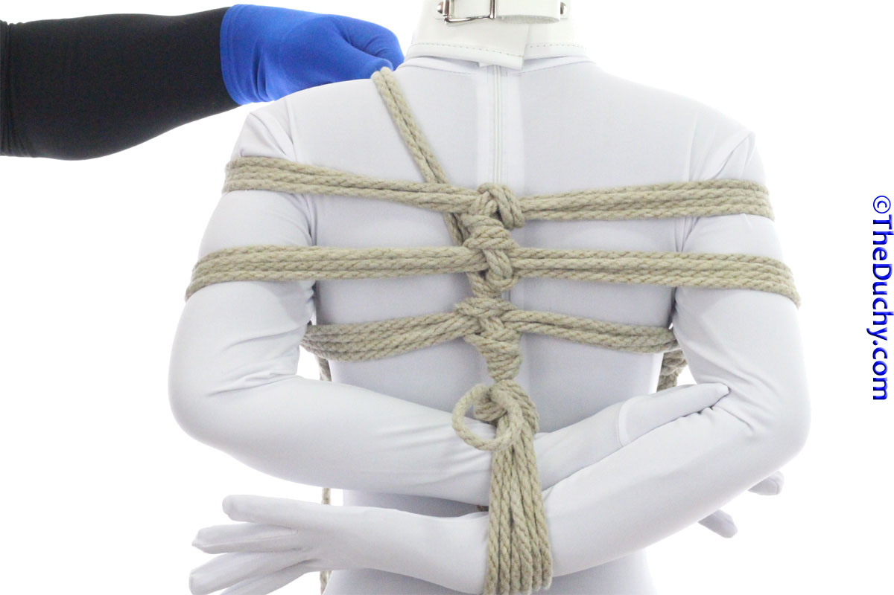

## [TK (Y-3TK) Gote Shibari - TheDuchy](https://www.theduchy.com/gote-shibari/#y-3tk)

There are 3 options (Y-3TK, X-3TK, Mt Fuji 3TK) for adding more stability,
security and artistry by adding a 3rd rope. These techniques can also be used
to “use up” rope that you may have left over from your 2TK.

-  1. After locking off the lower-wrap kannuki, bring the tail up between the ropes and the body
-  2. Bring it across the shoulder (we have been starting all new elements to the left)
-  3. You have several options on how to make the front look. Option 1 is like the Bikini Harness. Option 2 is like the Shinju.
-  4. (Option 1 – Bikini Harness Style) Lay the tail over top of both straps
-  5. Reach under the lower strap, placing your fingers on the *same side* of the tail as the shoulder the tail just came over
-  6. Reach under the upper strap, placing your fingers on the *same side* of the tail as the shoulder the tail just came over
-  7. Like this
-  8. Pull the tail through. The cords of the lower strap may deform slightly. Many riggers flatten them again, many do not. I have not done so in this tutorial
-  9. Run over the other shoulder. Skip to Step 15 to tie off.
-  10. (Option 2 – Shinju Style) Run the tail through itself below the top strap instead of above
-  11. Grab the tail
-  12. Pull it through and over the other shoulder. Alternatively…
-  13. …you can add and extra twist if you like…
-  14. Then run the tail over the other shoulder
-  15. Run the tail behind the upper strap and then tie the tail off to the center line or the strap on the opposite side. The next few steps show one way of doing so (many other ways are also just fine…)
-  16. I have a quite a bit of rope left, so I will go under the lower strap as well
-  17. Pull the tail through
-  18. Go across the center line
-  19. The lock it off with a half hitch or two
-  20. If you have a lot of rope left, you can use it up in a variety of ways. You can run the rope around the soft part of the belly, then tie it off back on the center line Or you could wind the rope around the straps Or you could make a series of Crossing Hitches around the back like in a classic 3TK (or “X-3TK” as shown below)…
-  21 Here is the completed Y3TK from the front.

